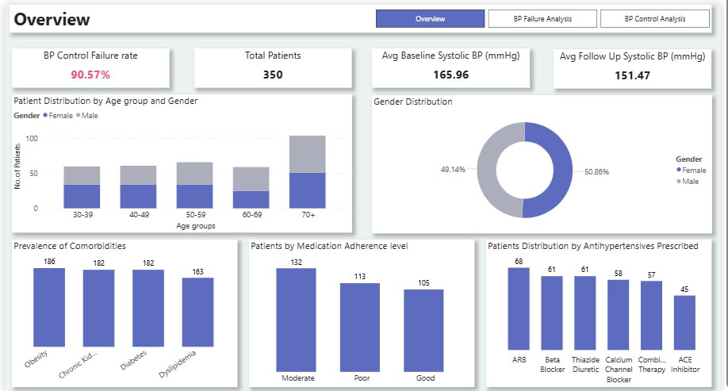
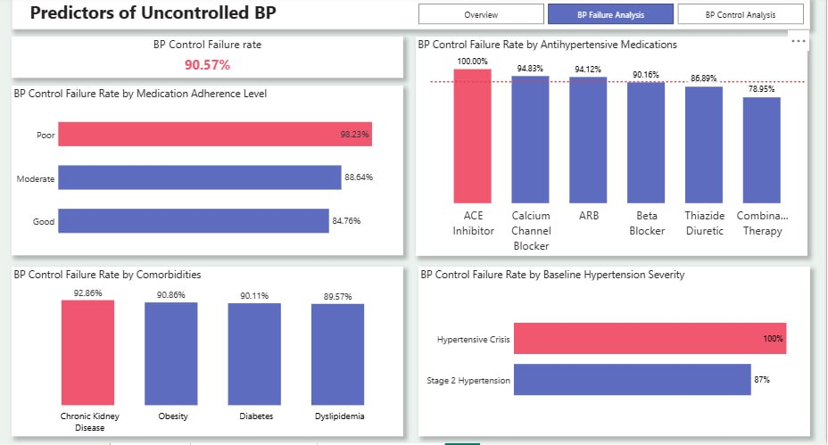
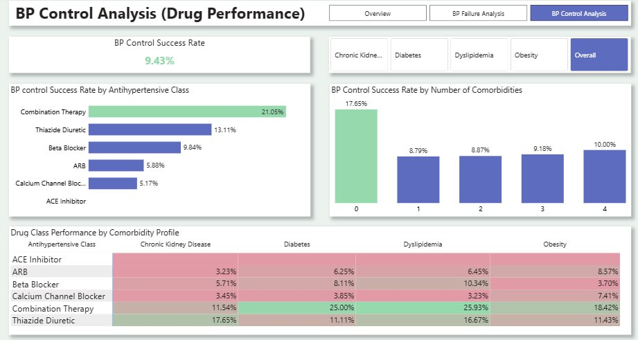

# Hypertension-Analytics-Blood-Pressure-Control-and-Drug-Effectiveness

## Executive Summary
Hypertension, or high blood pressure, is a major public health challenge and a leading risk factor for cardiovascular and kidney diseases. Despite advances in treatment, many patients still experience poor blood pressure control. 

This report presents a comprehensive analysis of hypertension treatment outcomes across 350 patients at the Hypertension Cardiology Center. The findings reveal a critically high BP control failure rate of 90.57%, with 317 out of 350 patients failing to achieve controlled blood pressure within 3 months of treatment. This report identifies the key clinical predictors driving this failure rate and provides evidence-based recommendations for improving treatment outcomes.

## Problem Statement 
* What predicts BP control failure at 3 months, and how can high-risk patients be identified at the point of prescription?
* Which antihypertensive drug class delivers the best outcomes for patients with specific comorbidity profiles?

## Dataset Overview
The dataset comprises 350 patient records from the Hypertension Cardiology Center, containing 16 columns spanning patient demographics, clinical measurements, comorbidity profiles, drug prescriptions, and treatment outcomes. Each row represents one unique patient.
The columns in the data contains:
* Demographics; Patient ID, Age, Gender.
* Comorbidities; Diabetes Mellitus, Chronic Kidney Disease, Dyslipidemia, Obesity.
* Baseline Clinical metrics; Systolic and Diastolic Blood pressure.
* Outcomes; Follow Up Systolic and Diastolic Blood pressures, Bp controlled after 3 months.
* Utilization; Number of visits and Registration date.

## Data Preparation & Preprocessing

### Data Quality Assessment
Upon loading the dataset into Microsoft Power BI via Power Query, an initial data quality assessment was conducted. The dataset was found to be clean with no missing values, no duplicate records, no outliers and no errors across all 350 rows and 16 columns. 

Data types were verified and confirmed as follows:
* Numeric columns: Age, Baseline_Systolic_BP, Baseline_Diastolic_BP, Followup_Systolic_BP, Followup_Diastolic_BP, Number_of_Visits
* Categorical columns: Gender, Diabetes_Mellitus, Chronic_Kidney_Disease, Dyslipidemia, Obesity, BP_Controlled_After_3_Months, Medication Adherence 
* Date column (Registration_Date) was correctly formatted as a date field.

### Feature Engineering
The following calculated columns and measures were created to support the analysis:

* Age Bins: Patients were grouped into age bands (30-39, 40-49, 50-59, 60-69, 70+) to enable age distribution analysis.
* Comorbidity_Count: A calculated column counting the number of comorbid conditions per patient (0 to 4), used to analyse success rates by drug performance.
* Baseline_BP_Category: Patients were categorised into Stage 2 Hypertension and Hypertensive Crisis based on clinical thresholds.
This classification follows the guidelines of the American Heart Association (AHA), which define blood pressure categories using systolic and diastolic thresholds:
* Normal BP: Systolic <120 mmHg and Diastolic <80 mmHg
* Elevated BP: Systolic 120–129 mmHg and Diastolic <80 mmHg
* Stage 1 Hypertension: Systolic 130–139 mmHg or Diastolic 80–89 mmHg
* Stage 2 Hypertension: Systolic 140–179 mmHg or Diastolic 90–119 mmHg
* Hypertensive Crisis: Systolic ≥180 mmHg or Diastolic ≥120 mmHg

All patients in the dataset already had Stage 2 Hypertension or higher at baseline; therefore, classification was limited to Stage 2 and Hypertensive Crisis to reflect severity within this high-risk group.

## Data Modeling
To enable comorbidity-level analysis without restructuring the original dataset, a supplementary Comorbidity_Table was created using the DAX UNION function.
This table consolidates (unpivoted) the four separate Yes/No comorbidity columns into a single column structure with fields: Patient_ID, Condition, BP_Controlled, and Drug_Class. A many-to-one relationship was established with the original Hypertension_Data table via Patient_ID, with bidirectional cross-filtering enabled. DISTINCTCOUNT was applied in all measures referencing this table to prevent patient count inflation.
All subsequent analysis was conducted on the verified, prepared dataset with no further data quality interventions required.

## Data Analysis
Key metrics were derived using DAX functions, including:
* BP control failure rate
* BP control success rate
* Total patient count
* Average baseline systolic BP
* Average follow-up systolic BP
These metrics were then segmented across multiple dimensions to address the key business questions.
The dataset was analyzed and visualized using PowerBI.

## Dashboard Overview 

## Key Insights
### Overall Failure Rate
The most striking finding in this dataset is the scale of BP control failure. Of 350 patients, 317 (90.57%) failed to achieve controlled blood pressure within 3 months of treatment initiation. Only 33 patients (9.43%) achieved BP control.

| Predictor | Implication |
|----------|-------------|
| Medication Adherence | Poor adherence patients failed at 98.23% — the strongest single predictor identified. Even good adherence only reduced failure to 84.76%, confirming adherence as a critical risk factor at every level. |
| Chronic Kidney Disease | CKD patients had the highest failure rate among all comorbidity groups (92.86%), exceeding the overall average. This suggests CKD is the most impactful comorbidity on treatment outcomes. |
| Baseline severity | Patients in Hypertensive Crisis show a 100% failure rate, compared to 87% in Stage 2 Hypertension. This suggests that the higher the initial BP, the lower the likelihood of achieving control. |
| ACE Inhibitors Drug class | ACE inhibitors show the highest failure (100%), followed by Calcium Channel Blockers (94.8%) and ARBs (94.1%). Combination therapy (79%) has the lowest failure rate. This indicates monotherapy is less effective in this high-risk population, while combining agents improves control. |

### High-Risk Patient Profile
Based on the analysis, a patient presenting with the following characteristics at point of prescription should be flagged as HIGH RISK for BP control failure:
* Poor medication adherence history
* Chronic Kidney Disease present
* Patients in Hypertensive Crisis

From the analysis, age, gender and number of visits did not show a clear or consistent relationship with BP control failure. Failure rates remained relatively similar across age groups and visit frequencies, indicating no distinct pattern or gradient.
As a result, these variables were not identified as key predictors of BP control failure in this dataset, compared to stronger factors indicated earlier.

### Drug Class Performance by Comorbidity Profile

Across all 350 patients, Combination Therapy delivered the highest BP control rate at 21.05%, followed by Thiazide Diuretic at 13.11%. ACE Inhibitors recorded 0% success - the lowest performing drug class across the entire dataset.
*Critical Observation: Combination Therapy Underutilization*
Despite delivering the highest overall success rate (21.05%) and leading in 3 of 4 comorbidity groups, Combination Therapy was prescribed to only 57 patients - fewer than ARB (68), Beta Blocker (61), and Thiazide Diuretic (61). The best-performing drug is being underutilized in favor of less effective single-drug alternatives.

*Critical Observation: ACE Inhibitor Performance*
ACE Inhibitors recorded 0% success across all four comorbidity groups - Diabetes, CKD, Obesity, and Dyslipidemia - with 45 patients prescribed this drug class. This is the most consistent finding in the dataset and warrants urgent clinical review.

## Recommendations 
* Introduce structured medication adherence programs for newly diagnosed hypertension patients. With poor adherence linked to a 98.23% failure rate, it represents the most significant predictor of poor outcomes. Recommended measures include adherence risk screening at prescription, routine follow-up calls, medication reminders, and targeted patient education.
* Implement a standardized system to identify high-risk patients. Individuals with CKD, a history of poor adherence, and baseline systolic BP ≥180 mmHg should be automatically flagged for closer monitoring, more frequent visits, and immediate adherence-focused interventions.
* Adopt combination therapy as a first-line approach for patients with diabetes, dyslipidemia, or obesity. It consistently outperforms single-drug treatments, yet remains underutilized despite delivering the best outcomes.
* Give preference to thiazide diuretics for patients with CKD. In this subgroup, they achieved a 17.65% success rate, outperforming combination therapy (11.54%), suggesting CKD-specific prescribing guidelines should be adjusted accordingly.
* Perform an immediate clinical review of ACE inhibitor use. With a 0% success rate across all comorbidity groups (45 patients), a formal audit is needed to determine whether this class should remain part of the standard treatment approach for these patients.
* Initiate more aggressive treatment strategies for patients presenting with hypertensive crisis (SBP >180 mmHg). Given the 100% failure rate under standard protocols, early use of combination therapy should be considered instead of delaying escalation until after treatment failure.

## Limitations
This analysis provides valuable insights into blood pressure control and treatment effectiveness; however, several limitations should be acknowledged. These limitations may affect the interpretation, generalizability, and overall robustness of the findings:
* Limited sample size
* Simplified comorbidity structure: Comorbid conditions are recorded in a binary format (Yes/No) without any severity grading. This means patients with mild disease and those with advanced or severe disease are treated equally in the analysis,limiting the clinical depth of interpretation.
* Absence of lifestyle and socioeconomic variables
* Observational study design limitations: The dataset is observational rather than experimental, so the results reflect associations rather than causal relationships. Therefore, we cannot conclude that any specific treatment directly caused improved or worsened blood pressure outcomes.

## Conclusion
This analysis of 350 hypertensive patients reveals a systemic BP control challenge that cannot be attributed to a 
single factor. The 90.57% failure rate reflects a convergence of clinical complexity, suboptimal prescribing 
patterns, and inadequate adherence support.
The two most actionable findings are:
* medication adherence is the single strongest modifiable predictor of failure
* Combination Therapy consistently outperforms single-drug alternatives across most comorbidity 
profiles yet remains underutilized.

Addressing these two factors alone through structured adherence programs and evidence-based drug selection 
has the greatest potential to meaningfully improve BP control rates in this patient population.
The recommendations in this report are grounded in the data and designed to be clinically actionable. 
Implementation should prioritize the highest-risk patients first, with systematic scale-up across the broader 
patient population

